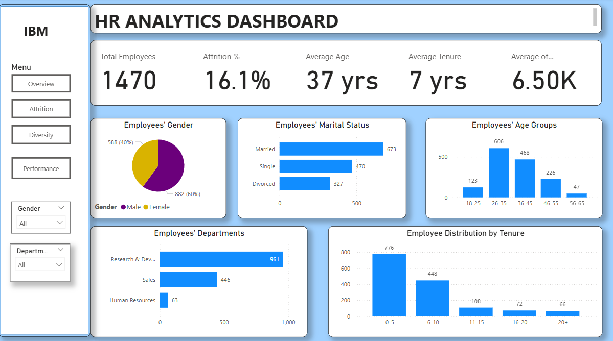

## Work Place Analytics
This project focuses on employee demographics, the attrition rates, performance metrics and diversity data. It provides actionable insights to support HR in decision making and workforce optimization strategy optimization using visualizations in Power Bi.
The analysis includes division of employees by gender, marital status, age group, tenures, their attrition by departments and many more.
## Tools Used
- **Excel** - Data Cleaning of the dataset
- **Power Bi** - Visualising the data
## Key Insights per Dashboard
1. Employee Overview

