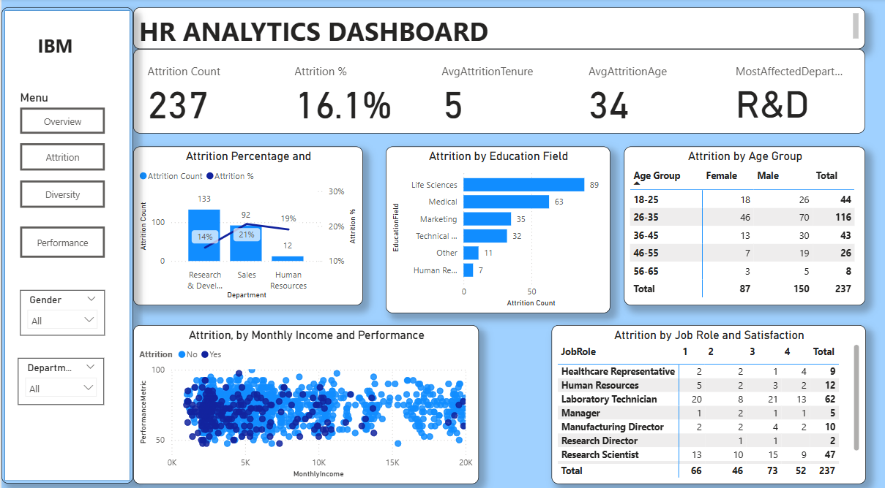
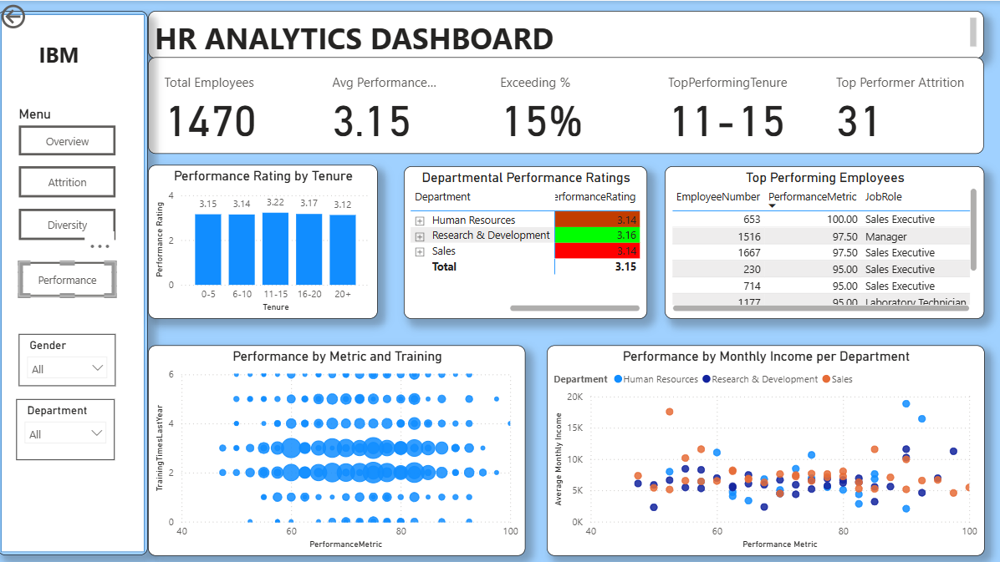
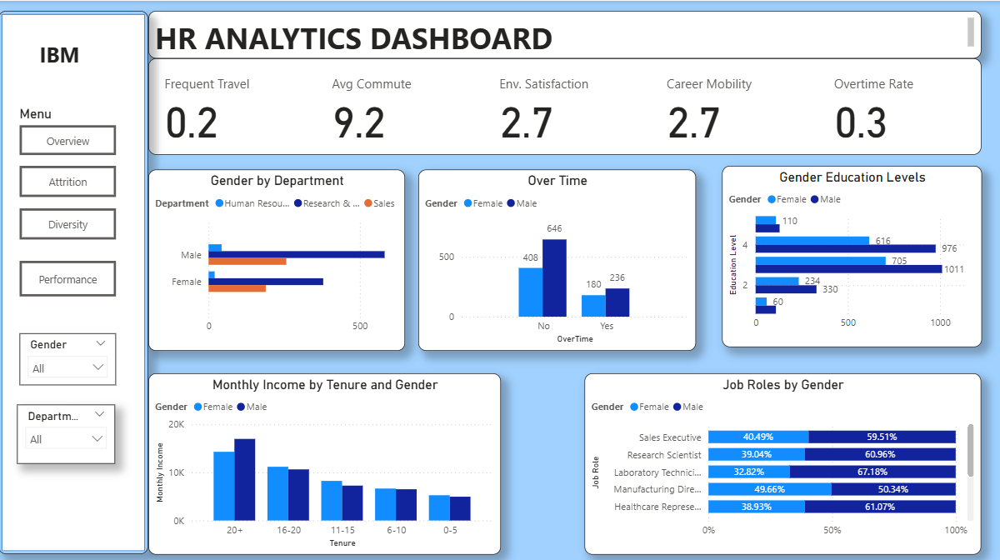

# Work Place Analytics

This project explores employee demographics, attrition rates, performance trends, and diversity metrics. It delivers actionable insights to support HR in strategic decision-making and workforce optimization through interactive Power BI dashboards.

The analysis covers key dimensions such as gender, marital status, age groups, tenure, department-level attrition, performance alignment, and work conditions.

---

## 📂 Dataset Used

The dataset is a fictional HR dataset containing 1,470 employee records with fields such as:
- Demographics (Gender, Age, Marital Status, Education)
- Job Information (Department, Job Role, Monthly Income, Overtime)
- Employee History (Years at Company, Number of Companies Worked, Business Travel)
- Performance Ratings and Attrition Status

_Source: [IBM HR Analytics Employee Attrition & Performance](https://www.kaggle.com/datasets/pavansubhasht/ibm-hr-analytics-attrition-dataset)_

---

## 🛠 Tools Used

- **Excel** – For data cleaning and initial formatting  
- **Power BI** – For data modeling, dashboard creation, and visualization  
- **DAX (Data Analysis Expressions)** – For calculated metrics and custom KPIs in Power BI  

---

## 📊 General Insights

- 👥 **Total Employees:** 1,470  
- 🔻 **Attrition Percentage:** 16.1%  
- 🔻 **Attrition Count:** 237  
- 🎂 **Average Age:** 37 years  
- 🕒 **Average Tenure:** 7 years  

---

## Key Insights by Dashboard

---

### **1. Employee Overview**  

**Highlights:**
- **Gender Split:** 60% Male (882), 40% Female (588)  
- **Dominant Age Group:** 26–35 years (606 employees); least = 56–65 years (47 employees)  
- **Department Distribution:** R&D = 65.4% (961 employees)  
- **Tenure Breakdown:**
  - 0–5 Years: 52.8% (776 employees)
  - 20+ Years: 4.5% (66 employees)  
- **Marital Status:** 45.8% of employees are married  

---

### **2. Employee Attrition**  

**Attrition Overview**
- 237 employees left the company, giving an attrition rate of 16.1%.
- Average age at attrition: **34 years**; average tenure: **5 years**.

**Attrition by Department and Role**
- R&D had the highest number of exits (133 employees).
- Sales had the highest attrition rate at 21%, despite having fewer total exits than R&D.
- Lab Technicians (62), Research Scientists (47), and Managers (25) were the most affected roles.

**Attrition by Demographics**
- The age group 26–35 years experienced the highest attrition (116 employees), suggesting career mobility or unmet expectations.
- Life Sciences and Medical education fields had the most exits (89 and 63 respectively).

**Attrition by Satisfaction and Performance**
- Employees across all satisfaction levels exited, including mid-to-high scores — indicating other hidden drivers beyond work conditions.
- No strong correlation between performance/income and attrition, suggesting non-financial factors may be influencing exits.

**Implications**
- Review retention efforts for mid-career professionals in technical roles.
- Reassess career development, recognition, and promotion opportunities in high-risk roles.

---

### **3. Performance Metrics**  

**Performance by Tenure**
- Employees with 11–15 years of tenure have the highest average performance rating (3.22).
- Newer employees (0–5 years) perform steadily at an average of 3.15.
- A slight decline is observed in the 20+ year group (avg. 3.12), which may suggest a need for renewed engagement at this stage.

**Departmental Performance**
- The Sales department slightly outperforms others, with an average score of 3.16.
- Performance ratings across all departments are close, indicating consistent evaluation but possibly masking distinctions between high and average performers.

**Training vs. Performance**
- Employees who completed 2–4 training sessions performed the best, with scores consistently in the 70–80 range.
- Employees with no or minimal training tended to underperform, showing the value of structured learning and development.

**Performance vs. Monthly Income**
- There's a positive but non-linear relationship between performance and income.
- Sales employees show wide income variation at similar performance levels, possibly due to commission structures.
- HR and R&D departments display tighter clusters, with compensation more directly aligned to performance.

**Attrition Risk**
- A total of 31 top performers left the company.
- These exits suggest possible issues such as lack of recognition, limited career progression, or compensation misalignment.

**Implications**
- Consider enhancing training initiatives and differentiating performance rewards more clearly.
- Analyze why high performers are leaving and apply targeted retention strategies for key roles and tenure bands.

---

### **4. Diversity Dashboard**  

**Workplace Conditions**
- 20% of employees travel frequently.
- Average commute distance is 9.2 km.
- Environment satisfaction scores average at 2.7 out of 4.
- Career mobility is moderate, with an average of 2.7 previous companies worked.
- 30% of employees work overtime, more common among males (236) than females (180).

**Gender Distribution**
- R&D and Sales departments are male-dominated.
- HR department has a higher female representation.
- Male employees consistently earn more than females across all tenure levels.

**Education and Roles by Gender**
- Education Level 3 and 4 are the most common for both genders.
- Males dominate technical and leadership roles, while females are more represented in healthcare and HR roles.

**Implications**
- Consider implementing equity audits and salary benchmarking to address gender income gaps.
- Promote inclusive growth strategies to balance leadership representation.
- Analyze overtime workloads by gender to ensure fair work-life balance practices.
