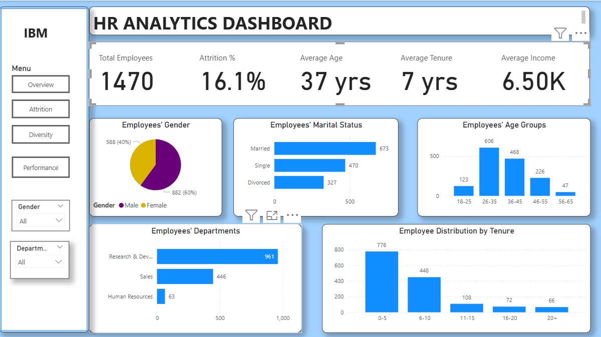

# Work Place Analytics

This project explores employee demographics, attrition rates, performance trends, and diversity metrics. It delivers actionable insights to support HR in strategic decision-making and workforce optimization through interactive Power BI dashboards.

The analysis covers key dimensions such as gender, marital status, age groups, tenure, department-level attrition, performance alignment, and work conditions.

---

## 📂 Dataset Used

The dataset is a fictional HR dataset containing 1,470 employee records with fields such as:
- Demographics (Gender, Age, Marital Status, Education)
- Job Information (Department, Job Role, Monthly Income, Overtime)
- Employee History (Years at Company, Number of Companies Worked, Business Travel)
- Performance Ratings and Attrition Status

_Source: IBM HR Analytics Employee Attrition & Performance (Kaggle)_

---

## 🛠 Tools Used

- **Excel** – For data cleaning and initial formatting  
- **Power BI** – For data modeling, dashboard creation, and visualization  
- **DAX (Data Analysis Expressions)** – For calculated metrics and custom KPIs in Power BI  

---

## 📊 General Insights

- 👥 **Total Employees:** 1,470  
- 🔻 **Attrition Percentage:** 16.1%  
- 🔻 **Attrition Count:** 237  
- 🎂 **Average Age:** 37 years  
- 🕒 **Average Tenure:** 7 years  

---

## Key Insights by Dashboard

---

### **1. Employee Overview**  

**Highlights:**
- **Gender Split:** 60% Male (882), 40% Female (588)  
- **Dominant Age Group:** 26–35 years (606 employees); least = 56–65 years (47 employees)  
- **Department Distribution:** R&D = 65.4% (961 employees)  
- **Tenure Breakdown:**
  - 0–5 Years: 52.8% (776 employees)
  - 20+ Years: 4.5% (66 employees)  
- **Marital Status:** 45.8% of employees are married  

---

### **2. Employee Attrition**  

**Key Insights:**
- **Attrition Rate:** 16.1% (237 employees out of 1,470)  
- **Most Affected Department:** R&D leads with the highest attrition count (133), while Sales has the highest attrition rate (21%)  
- **Average Exit Age & Tenure:** Age 34 with 5 years at the company  
- **Education Fields:** Life Sciences (89) and Medical (63) account for the most exits — consider reviewing workload or career growth in these fields  
- **Age Group:** Employees aged 26–35 are the most affected (49% of exits), possibly due to career mobility or unmet expectations  
- **Roles Most Affected:** Lab Technicians (62 exits), Research Scientists (47), and Managers (25)  
- **Satisfaction Levels:** Attrition is spread across all satisfaction scores — further feedback may be needed to uncover hidden dissatisfaction  
- **Performance vs. Income:** No clear link between high pay or performance and retention — suggests non-financial factors (like growth or engagement) are driving exits  

**Implications:**  
Review employee engagement strategies, especially for mid-career staff in technical roles. Support retention through clearer growth paths, recognition, and mentoring.

---

### **3. Performance Metrics**  

**Performance by Tenure**
- 11–15 years tenure = highest average rating (3.22)  
- Newer employees (0–5 years) average 3.15  
- 20+ year tenure group shows slight decline (3.12)  

**Departmental Performance**
- Sales performs slightly above others (3.16)  
- Narrow performance spread suggests consistent evaluation but limited differentiation  

**Training vs. Performance**
- 2–4 training sessions = strongest performers  
- No/low training correlates with underperformance  

**Performance vs. Monthly Income**
- Positive but non-linear relationship  
- Sales shows wide income range at similar performance levels (commission-based?)  
- HR and R&D = more consistent compensation structure  

**Attrition Risk**
- 31 top performers exited, pointing to issues like unmet career goals or pay misalignment  

---

### **4. Diversity Dashboard**  

**Key Insights:**
- **Travel & Commute:** 20% of employees travel frequently; average commute distance is 9.2 km  
- **Workplace Experience:** Environment satisfaction is moderate (2.7/4), and employees have worked at ~2.7 previous companies  
- **Overtime Load:** 30% of employees work overtime — more common among males (236 vs 180 females)  
- **Gender by Department:** R&D and Sales are male-dominated; HR has more female staff  
- **Education by Gender:** Education Level 3 and 4 are most common for both genders  
- **Gender Pay Gap by Tenure:** Males earn more at every tenure level, suggesting a potential gender-based income gap  
- **Job Role Distribution:** Technical and leadership roles skew male, while healthcare and HR roles have higher female representation  

**Implications:**  
Consider equity audits and role-based training to promote fair opportunities and address gender imbalances. Review overtime and satisfaction by department to improve inclusivity and work-life balance.

---
